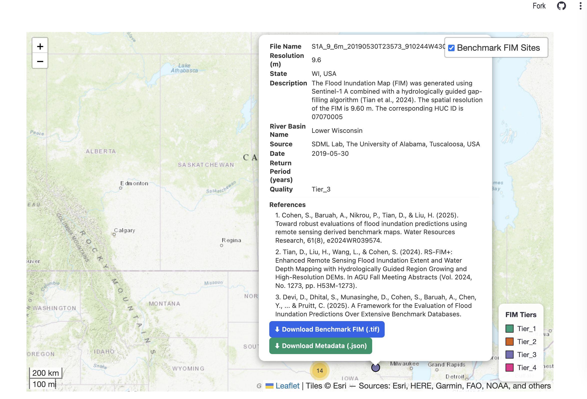

The Interface of FIM Vizualizer which shows all the FIM benchmark for all Tiers of FIM database that looks like:

Each FIM location is shows in the map, zoom into gives the more detailed location. If user clicks the location, it will pops up the metadata of this benchmark and Users can directly download the FIM  in raster (.tif) format and meta data as well as all for FIM evaluation, AOI and other required information. User can directly download from the pops up or seamlessly using the framework.

Here is how it looks when user clicks each FIM location: it will show data of flood, FIM tier, resolution and all other information.

On the left pane user can filter based on tier, date, and even activate the FIM extent. Note that the FIM extent is simplified just for rendering purpose, it doenot necessarily reflect the actual accurate delineation, So download tif raster to get actual resolution. 

Here is how it shows up when FIM extent is activated.

This is still on development phase and live at This app is live at: https://fimbench.streamlit.app/

The final version will be released soon. 

**For more information**

Email: sdhital@crimson.ua.edu